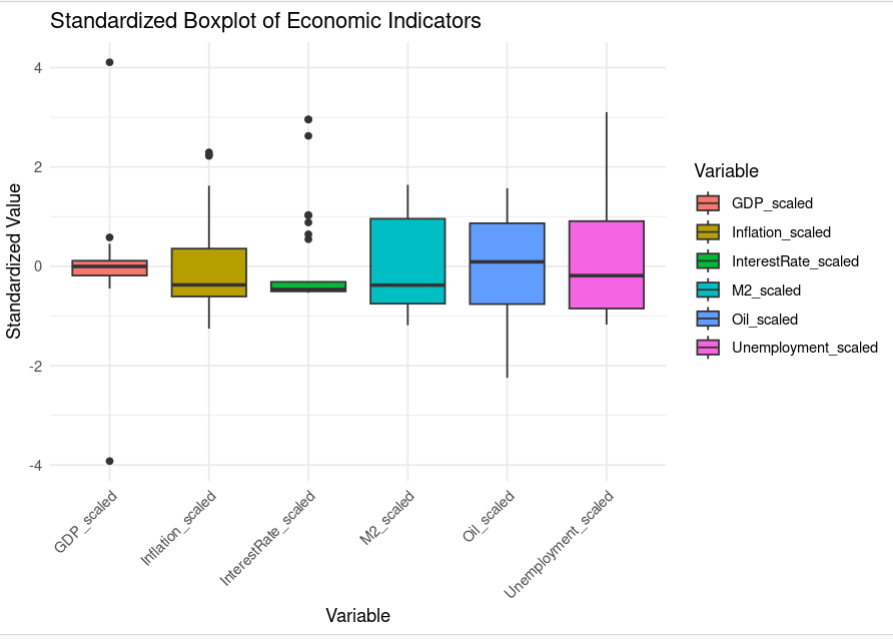
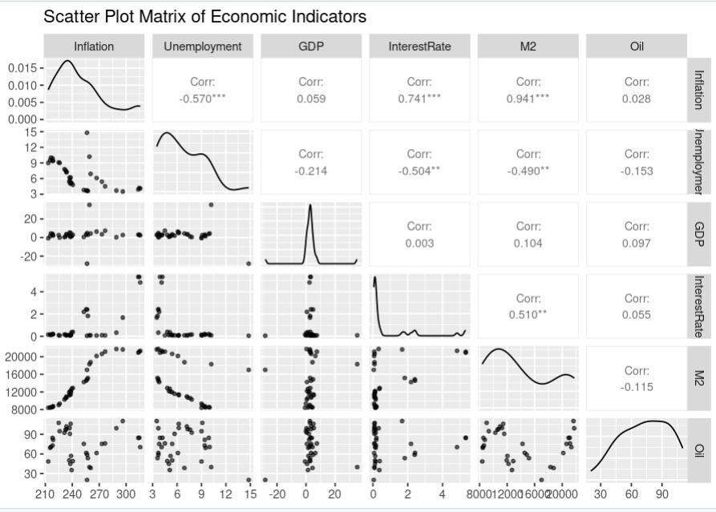
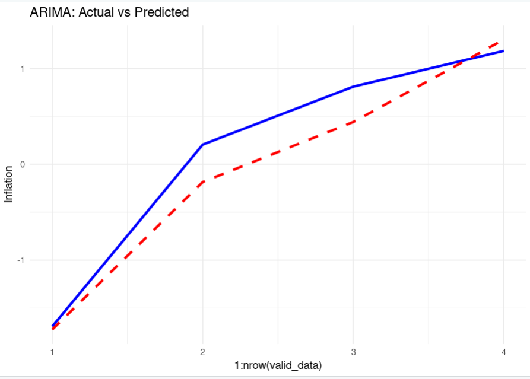
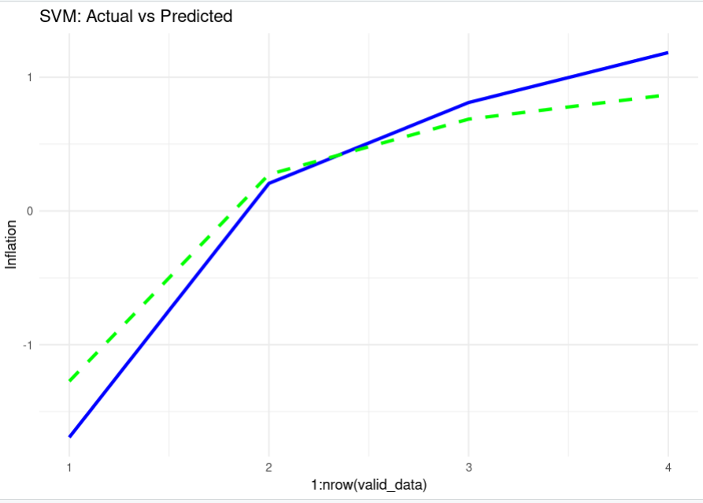
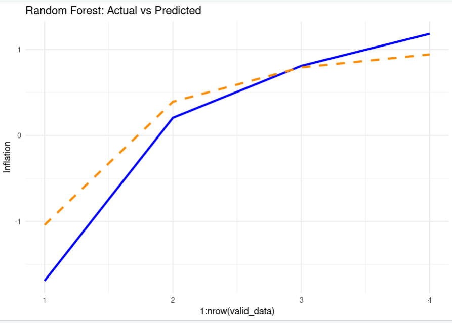
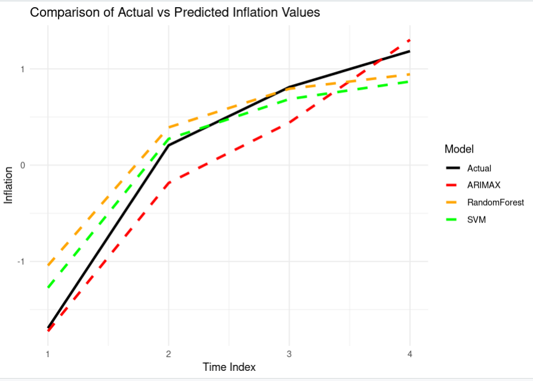

# Inflation Forecasting and Analysis using Machine Learning Models 📈

## 📌 Project Title
**Advanced Statistics Final Project: Inflation Prediction in the USA**

---

## 🧠 Overview

This project aims to analyze and predict **Inflation** in the USA using a variety of statistical and machine learning models. Using economic indicators such as **Unemployment**, **GDP**, **Interest Rates**, **M2 Money Supply**, and **Oil Prices**, we build and compare three models:

- **ARIMA (Auto Regressive Integrated Moving Average)**
- **Support Vector Machine (SVM)**
- **Random Forest Regressor**

The ultimate goal is to determine which model predicts inflation most accurately.

---

## 📂 Dataset Description

- **File Used**: `USA_Inflation_Filtered_Data.csv`
- **Time Frame**: Monthly data (ensure `Date` is in proper `YYYY-MM` format)
- **Variables**:
  - `Date`
  - `Inflation` (Target Variable)
  - `Unemployment`
  - `GDP`
  - `InterestRate`
  - `M2`
  - `Oil`

The dataset was preprocessed to remove missing values and outliers using the IQR method.

---

## 🔍 Project Workflow

### 📌 1. **Data Cleaning and Preprocessing**
- Removed rows with missing values (`NA`)
- Handled outliers using the **IQR method**
- Scaled all numeric features using **Z-score normalization**

### 📌 2. **Exploratory Data Analysis (EDA)**
- **Summary Statistics** including Mean, Median, and Mode
- **Boxplot** of all standardized variables
- **Scatter Plot Matrix** to show relationships and correlations between variables

### 📌 3. **Feature Selection**
- Used **Recursive Feature Elimination (RFE)** with Random Forest to select the most impactful features for predicting Inflation.

### 📌 4. **Model Building and Evaluation**
- Split data into **80% training** and **20% testing**
- Trained three models:
  - **ARIMA** for time series forecasting
  - **Support Vector Machine** for regression
  - **Random Forest Regressor**
- Evaluation Metric: **Mean Squared Error (MSE)**

### 📌 5. **Visualization**
- Graphs for **Actual vs Predicted** values for each model
- Included visual representations of summary statistics and data distribution

---

---
## GRAPHS OF IMPLEMENTATION

### 📊 Box Plot of Standardized Variables


### 🔍 Scatter Plot Matrix


### 📈 ARIMA: Actual vs Predicted


### 🤖 SVM: Actual vs Predicted


### 🌲 Random Forest: Actual vs Predicted


### 🤖 SVM: Combined Actual vs Predicted



---

## 📊 Model Performance Summary

| Model         | Mean Squared Error (MSE) |
|---------------|--------------------------|
| ARIMA         | * 0.0141*                |
| SVM           | * 0.0085*                |
| Random Forest | * 0.0063*                |

🔍 **Observation**: The **Random Forest Regressor** had the lowest MSE, indicating it was the most accurate model on the test data.


## 📦 Required Libraries

Ensure the following R packages are installed:

```r
install.packages(c("readr", "ggplot2", "dplyr", "tidyr", "GGally", 
                   "caret", "e1071", "randomForest", "forecast", "tseries"))
```

---
## How to Run the Project
```r
git clone https://github.com/yourusername/inflation-forecasting-project.git
cd inflation-forecasting-project
```
-**Step 2: Open the R Script**
 Open inflation_forecasting.R in RStudio or any R IDE.
 Make sure the dataset file USA_Inflation_Filtered_Data.csv is in the same directory.

-**Step 3: Run the Code**
Run the entire script line by line or by sourcing the file.
All plots will be displayed, and model results will be printed in the console.

---

## Author
- **M. Abdullah Alamdar**
- **Student ID: 23i2597**
- **Program: DS-C**

